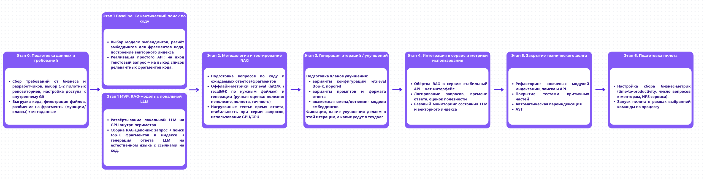

# Дизайн ML системы сервиса CodeAtlas

## 1. Цели и предпосылки

### 1.1. Зачем идем в разработку продукта?

#### Бизнес-цель

Создать внутренний сервис, который скачивает и индексирует репозитории компании, чтобы разработчики, в частности новые сотрудники, могли быстро задавать вопросы о содержимом кода на естественном языке и получать точные ответы с привязкой к конкретным файлам и фрагментам кода

Основные бизнес-цели:

- Сокращение времени онбординга новых разработчиков (time-to-productivity)
- Снижение нагрузки на менторов и разработчиков, которые сейчас много времени тратят на объяснение устройства кодовой базы
- Повышение прозрачности и доступа к знаниям о системе
- Ускорение восстановления контекста у текущих разработчиков

---

#### Текущий процесс и проблемы

Сейчас новый разработчик при онбординге:

- вручную ищет по репозиториям через поиск IDE
- читает разрозненную документацию 
- задаёт вопросы в общих чатах и напрямую ментору 
- тратит много времени на попытки понять, где именно в коде реализована нужная логика

Основные проблемы:

- документация часто устаревшая и не покрывает реальные случаи
- одни и те же вопросы повторяются у каждого нового разработчика
- опытные разработчики отвлекаются на объяснения вместо фокуса на продуктовых задачах

---

#### Почему станет лучше с использованием ML

1. **Сокращение времени онбординга и вывода разработчиков на продуктивность**  
   Сервис позволяет задавать вопросы о коде на естественном языке и сразу получать релевантные ответы. Новички быстрее начинают брать и закрывать реальные задачи.

2. **Снижение нагрузки на менторов и senior-разработчиков**  
   Часть типичных вопросов уходит в сервис. Старшие разработчики меньше отвлекаются на повторяющиеся объяснения и могут фокусироваться на сложных задачах.

3. **Автоматическая актуальность знаний о системе**  
   Индексация репозиториев завязана на CI / webhooks git: при изменении кода переиндексируются только затронутые файлы. В отличие от документации, которая быстро устаревает, ML-сервис работает с реальным актуальным кодом, что снижает риск ошибок из-за устаревшей информации.

---

#### Что будем считать успехом итерации с точки зрения бизнеса

- Среднее время закрытия первого рабочего таска новым разработчиком сократилось хотя бы на **15%** по сравнению с историческими данными или контрольной группой.

- Количество вопросов по архитектуре и коду в чатах и личных сообщениях снизилось минимум на **20%** при сопоставимом количестве новых разработчиков.

- Не менее **70%** новых разработчиков пользуются сервисом в первые две недели онбординга (≥10 запросов в неделю на пользователя).

- Средняя оценка сервиса по результатам опроса новых разработчиков не ниже **4 из 5**.

- Не менее **60%** опрошенных отмечают, что сервис *заметно упростил понимание кодовой базы*.

- По внутренней ручной оценке не менее **70%** ответов сервиса помечаются разработчиками как *полезные* или *очень полезные*.

### 1.2. Бизнес-требования и ограничения

#### 1.2.1. Краткое описание бизнес-требований

**Функциональные бизнес-требования**

1. **Поиск ответов по коду на естественном языке**
   - Разработчик задаёт вопрос на русском о кодовой базе.
   - Сервис возвращает ответ в формате QA с:
     - кратким объяснением
     - ссылками на конкретные файлы и строки кода

2. **Автоматическая индексация репозиториев**
   - Подключение к внутреннему Git
   - Первичное скачивание и индексация выбранных репозиториев
   - Обновление индекса при каждом новом коммите через CI / webhooks

3. **Поддержка онбординга новых разработчиков**
   - Возможность выбрать проект/репозиторий и сразу задавать вопросы
   - Библиотека примерных запросов по типичным бизнес-флоу

4. **Сбор аналитики для оценки эффекта**
   - Логирование запросов (обезличенно), времени ответа и оценки полезности
   - Базовый отчё: количество активных пользователей, частота запросов, доля полезных ответов

---

#### 1.2.2. Нефункциональные требования и архитектурные ограничения

**Безопасность и размещение моделей**

1. **Только локальная LLM внутри периметра компании**
   - Использование **развёрнутой модели**
   - Запрещён вывод исходного кода и запросов разработчиков во внешние API
   - Доступ к сервису по корпоративной аутентификации, с разграничением прав по проектам

2. **Ограничения по данным**
   - Логирование запросов и ответов только в обезличенном виде, без сохранения фрагментов кода дольше необходимого.

**Требования к производительности и инфраструктуре**

3. **Время отклика**
   - Целевое время ответа на типовой запрос: **до 3–5 секунд** при пилотной нагрузке.
   - Для тяжёлых запросов (длинные контексты)  до 10 секунд

4. **Требования к GPU/инфраструктуре**
   - Сервис LLM развёрнут на выделенном GPU-сервере/кластере.
   - Минимальные ожидания по инфраструктуре:
     - 1–2 GPU уровня **NVIDIA A100 / H100 /  аналог** с памятью 80 GB
     - возможность горизонтального масштабирования
   - Использование квантованных/оптимизированных моделей, если это необходимо для укладывания в доступные ресурсы

5. **Масштабируемость**
   - MVP: до 50 пользователей и 10 репозиториев
   - Возможность масштабирования до нескольких сотен пользователей за счёт:
     - горизонтального масштабирования API и векторного хранилища
     - добавления GPU-ресурсов для LLM

6. **Надёжность и доступность**
   - Доступность сервиса в рабочее время не ниже **99%** в рамках пилота.
   - При недоступности сервиса разработчики продолжают работать с обычными инструментами 

7. **Управление жизненным циклом моделей**
   - Возможность обновления версии LLM/эмбеддингов без простоя сервиса 
   - Мониторинг качества ответов и основных метрик

---

#### 1.2.3. Бизнес-ограничения

- **Бюджет**
  - Жёсткий лимит на:
    - закупку/аренду GPU-ресурсов
    - сопровождение инфраструктуры LLM
  - Предпочтение использованию существующих серверов и open-source-моделей при приемлемом качестве
- **Технологические ограничения**
  - Интеграция только с существующими внутренними системами
  - Нельзя изменять текущие процессы релизов команд

---

#### 1.2.4. Ожидания от текущей итераци

- Поднять **полностью локальный** контур: индексация + векторное хранилище + LLM на GPU внутри периметра
- Поддерживать сценарий:
  - индексация 1–2 репозиториев пилотной команды
  - ответы на вопросы через чат-интерфейс
  - логирование запросов и оценок полезности
- Показать, что локальная LLM на имеющихся GPU:
  - обеспечивает целевое время ответа
  - даёт достаточно хорошее качество ответов для поддержки онбординга

---

#### 1.2.5. Бизнес-процесс пилота 

1. Выбор команды и репозиториев
2. Настройка прав доступа и подключение к внутреннему Git.
3. Запуск первичной индексации и развёртывание локальной LLM на GPU.
4. Обучение разработчиков работе с сервисом 
5. Ежедневное использование сервиса в задачах онбординга и текущей разработки
6. Сбор метрик:
   - время до первого рвабочего таска
   - количество вопросов к менторам
   - активность использования сервиса
   - загрузка GPU и время ответа модели
   - пользовательская оценка ответов

---

#### 1.2.6. Успешный пилот и пути развития

**Пилот считаем успешным, если:**

- время до первого рабочего таска сократилось на ≥ **15%**
- количество вопросов по коду к менторам снизилось на ≥ **20%**
- ≥ **70%** новых разработчиков активно пользуются сервисом
- средняя оценка сервиса ≥ **4.0/5**, ≥ **60%** пользователей говорят, что сервис заметно помогает
- локальная LLM на выделенных GPU укладывается в целевые показатели по времени ответа и стоимости

**Дальнейшее развитие:**

- расширение на другие команды и репозитории
- подключение дополнительных GPU / оптимизация моделей при росте нагрузки
- интеграция с IDE и внутренними порталами
- более продвинутый ML-контур (персонализация, улучшенные модели)

### 1.3. Что входит в скоуп итерации, что не входит

#### 1.3.1. На закрытие каких БТ подписываемся

- Локальный сервис qa по коду
- Автоматическую индексацию кода + переиндексацию по webhook из git/ci
- Интеграцию с локальной LLM на GPU внутри периметра компании
- Базовый сбор метрик использования 
- Поддержка Python, C, C++

#### 1.3.2. Что не входит в скоуп

- Масштабирование на все команды и все репозитории
- Интеграции с IDE и сложный UI (только простой чат-интерфейс)
- Глубокую оптимизацию производительности под высокую нагрузку
- Дообучение моделий, квантизация под вопросом 
- Поддержка всех языков программирования 

#### 1.3.3. Планируемый технический долг

- Настроить автоматическую переиндексацию репозиториев по webhook Git/CI
- Продвинутый мониторинг 
- Доступ к разным репозиториям по ACL

### 1.4. Предпосылки решения

1. **Бизнес-контекст и проблема**
   - В компании есть крупные внутренние репозитории 
   - Онбординг новых разработчиков занимает много времени: сложно разобраться в архитектуре и найти нужный код
   - Менторов и senior-разработчики тратят время на повторяющиеся объяснения

2. **Используемые данные и скоуп**
   - Источник данных: **внутренние Git-репозитории** 
   - MVP фокусируется на 1–2 репозиториях пилотной команды
   - Гранулярность: фрагменты кода уровня *функция / класс / логический блок файла*
   - Дополнительные артефакты (wiki, схемы) вне скоупа первой итерации

3. **ML-подход и архитектурные предпосылки**
   - Используем RAG-подход: эмбеддинги кода + векторное и графовое хранилища хранилище + LLM, которая формирует ответ по top-K фрагментам, информации из графавой базы данных и файлов 
   - LLM и векторный поиск разворачиваются локально, внутри периметра компании код и запросы не уходят во внешние сервисы
   - Предполагается наличие GPU-ресурса для инференса локальной LLM

4. **Характер задач**
   - Система не делает долгосрочный прогноз, а отвечает на запросы здесь и сейчас
   - Гранулярность результата один ответ на один запрос разработчика, с ссылками на конкретные места в коде

5. **Организационные предпосылки**
   - Есть команда, готовая использовать сервис в реальной работе и давать обратную связь
   - Менторы и тимлиды готовы участвовать в оценке качества ответов и замере метрик

Эти предпосылки позволяют сфокусировать первую итерацию на проверке бизнес-гипотезы: действительно ли локальный сервис qa по коду сокращает время онбординга и снижает нагрузку на менторов

## 2. Методология Data Scientist

### 2.1. Постановка задачи

Решаемая техническая задача - разработка ML-сервиса вопрос-ответ по коду на основе локальной LLM и гибридного retrieval (векторного + графового):

- Построить пайплайн **индексации репозиториев**: скачивание кода, разбиение на фрагменты, вычисление эмбеддингов и сохранение во векторное хранилище (baseline) и дополнительно в графовое (MVP)
- Реализовать **семантический поиск по коду**: по текстовому запросу разработчика находить релевантные фрагменты кода (top-K сниппетов)
- Реализовать **графовый поиск по коду**: извлекать связанные сущности и контекст через Neo4j/Cypher (DEFINES/CALLS/IMPORTS/INHERITS) и объединять с результатами семантического поиска
- Реализовать **qa-слой на базе локальной LLM**: формировать понятный ответ на естественном языке с ссылками на конкретные файлы и строки
- Обернуть решение в **продовый сервис** , пригодный для пилота внутри одной команды разработки

### 2.2. Блок-схема этапов разработки

### 2.3. Этапы решения задачи

### Этап 1. Подготовка данных

**Данные и сущности**

- Источники данных: для MVP/Baseline - любые репозитории компании. Для построения решения было предоставлено 5 репозиториев, на основе которых будет подбираться структура графовой базы и стратегия индексации. Эти репозитории будут использоваться для валидации. Для каждого репозитория были составлены 15-20 вопросов с правильным ответом для дальнейшей валидации и *LLM-as-a-judge*
- Репозитории фиксируем по `repo + branch + commit_sha`.
- Основные сущности:

   - **Repository:** `repo_id, name, url/path, branch, commit_sha`
   - **File:** `repo_id, path, extension, size_bytes, hash`
   - **Symbol:** `{module, class, function, method}, name, qualified_name, file_path, span(start_line, end_line)`
   - **Edges:** `DEFINES, CALLS, IMPORTS, INHERITS`
   - **Chunk:** фрагмент на уровне `function/method/class` + `file_path + lines`
   - **Embedding:** `chunk_id, vector, model_version`

---

**Выявленные проблемы/риски по EDA**

- Большое количество разных языков программирования: есть возможность покрыть пока малую часть
- Дисбаланс объёма: репозитории абсолютно разных размеров
- Шум по типам файлов: много не кода и служебной информации, которая тоже может быть полезна -> риск ухудшения поиска
- Мало комментариев и докстрингов -> нужно строить качественный граф + по возможности добавлять докстринги с помощью LLM для более общих вопросов на понимание репозитория, это большая проблема
- Риски ошибок парсинга AST и неполного/шумного графа

---

**Процесс обработки данных**

- Первичная индексация репозиториев
- Инкрементальные обновления по webhook/CI на push/merge (технический долг)

Шаги (Baseline):
- Clone репо -> фиксируем commit_sha
- Обход файлов -> whitelist расширений (.py/.c/.cpp/.h/.hpp)
- Чанкинг
- Эмбеддинги чанков -> запись в Qdrant с метаданными

Шаги (MVP):
- Все шаги Baseline
- Парсинг кода -> извлекаем сущности и связи (imports/calls/inherits/refs)
- Построение графа знаний -> запись узлов/рёбер в Neo4j

---

**Если данных недостаточно**

- На данный момент репозиториев достаточно. Но для качественной оценки нужно собрать около 25–30 типовых вопросов от команды для каждого репозитория

---

**Конфиденциальность и обработка**

- Доступ к разным репозиториям по ACL
- Логи только обезличенные метрики

---

**Необходимый результат этапа**

- Репо скачаны и зафиксированы по `commit_sha` 
- Настроен whitelist/фильтры файлов
- Построен граф знаний (узлы/рёбра) и сохранён в графовую бд
- Сформированы чанки на уровне функций/методов/классов и рассчитаны эмбеддинги
- Векторный индекс и метаданные готовы для retrieval/RAG
- Подготовлен набор для валидации (вопросы/кейсы) и базовый EDA

---

**Baseline vs MVP**

- **Baseline:** без графовой БД. Индексация кода -> простой чанкинг -> эмбеддинги -> векторное хранилище (Qdrant). Ответы формируются LLM на основе top-K retrieved чанков. Без инструментов графового поиска и без file-read.

- **MVP:** baseline + графовая БД (Neo4j) с сущностями и связями (`DEFINES/CALLS/IMPORTS/INHERITS`) + LangGraph-агент с инструментами: графовый поиск, семантический поиск, чтение файлов по строкам. Поддержка инкрементальной переиндексации по webhook/CI.

---

**Репозитории**

* [https://github.com/huggingface/pytorch-image-models](https://github.com/huggingface/pytorch-image-models)
* [https://github.com/rwightman/pytorch-commands](https://github.com/rwightman/pytorch-commands)
* [https://github.com/alfitranurr/VISION-MEDICINE](https://github.com/alfitranurr/VISION-MEDICINE)
* [https://github.com/nottyo/football-bot](https://github.com/nottyo/football-bot)
* [https://github.com/subarnasaikia/Tic-Tac-Toe](https://github.com/subarnasaikia/Tic-Tac-Toe)

### Этап 2. Подготовка прогнозных моделей

**Контекст:** прогнозная модель реализована как связка:
1) **retrieval-модель** (эмбеддинги + поиск в Qdrant) - отвечает за нахождение релевантного кода/сущностей
2) **LLM** - формирует финальный ответ по собранному контексту
3) (только в MVP) **агент** (LangGraph), который комбинирует инструменты и собирает контекст

В **MVP** агент (LangGraph) имеет инструменты и может комбинировать:
1) **Поиск по графу** (Neo4j / Cypher)
2) **Семантический поиск** (Qdrant / embeddings)
3) **Чтение файлов** (получение фрагмента кода по `path + start_line/end_line`)

---

## Выбранные модели

**Локальная LLM (генерация ответа):**
- **Qwen Code 32B Instruct** (локально, внутри периметра)

**Embedding-модели (retrieval):**
- В рамках MVP протестированы 3 эмбеддера:
  - `BAAI/bge-small-en-v1.5`
  - `jinaai/jina-embeddings-v2-base-code`
  - `sentence-transformers/all-MiniLM-L6-v2`

**Выбор для пилота (качество/стоимость индексации):**
- **`BAAI/bge-small-en-v1.5`** - почти сопоставимое качество retrieval при существенно более быстрой индексации, чем у `jinaai/jina-embeddings-v2-base-code`
- `jinaai/jina-embeddings-v2-base-code` рассматриваем как кандидат на следующую итерацию при оптимизации/ускорении индексации (или при необходимости максимизировать recall ценой времени пересчёта)

---

#### 2.1 Формирование выборок (baseline vs MVP)

##### 2.1.1 Retrieval-датасет
**Цель:** оценить качество поиска релевантных сущностей/фрагментов кода

- **Состав:** 5 репозиториев * **10 вопросов** = **50** вопросов
- Для каждого вопроса задана golden-разметка:
  - `golden_path` - ожидаемый путь до файла/фрагмента
  - `golden_full_name` - ожидаемое полное имя сущности (qualified name)

**Репрезентативность:**
- репозитории разного масштаба и структуры 

##### 2.1.2 RAG-датасет (оценка качества ответа)
**Цель:** оценить качество финального ответа по шкалам judge

- **Состав:** 5 репозиториев, в среднем **5-10 вопросов на репозиторий** 
- Для каждого вопроса есть эталонная логика/ожидаемые пункты ответа (используется judge-LLM)

**Примечание по развитию датасета:**
- Текущий набор достаточен для первичной итерации и сравнения baseline vs MVP
- Для более устойчивых выводов планируется расширение до **>=25 вопросов на репозиторий** 

---

#### 2.2 Целевая переменная (согласование с бизнесом)

Задача формализуется как **поиск релевантного контекста и генерация полезного ответа**:

- **Retrieval target (по разметке):**
  - бинарная релевантность: найден ли golden-объект в top-K (для `golden_path` и `golden_full_name`)
- **RAG target (качество ответа):**
  - judge-оценки (1-5): correctness/completeness/precision/refusal/actionability/clarity

Связь с бизнесом (онбординг и снижение нагрузки на менторов):
- рост Recall@K/MRR@K -> чаще находится нужный код -> меньше времени на поиск и уточнения у коллег
- рост Correctness/Actionability -> ответы можно применять -> меньше эскалаций к менторам

---

#### 2.3 ML-метрики и функции потерь

#### Retrieval-метрики (по golden разметке)
Считаем метрики отдельно по двум голденам:
- `golden_path` (ожидаемый путь)
- `golden_full_name` (ожидаемое полное имя сущности)

Метрики:
- **Recall@K** - доля вопросов, где релевантный объект найден в топ-K
- **MRR@K** - насколько высоко появляется первый релевантный результат
- **nDCG@K** - качество ранжирования (с учетом позиции)

#### Метрики качества ответа (LLM-as-a-Judge, шкала 1–5)
- **Correctness, Completeness, Precision, Refusal appropriateness, Actionability, Clarity**

### Метрики времени
- **avg_search_latency_s** - latency retrieval (Qdrant)
- **index_latency_s** - время индексации (эмбеддинг + запись)
- **avg_answer_latency_s** - время ответа RAG
- **avg_judge_latency_s** - latency judge

---

#### 2.4 Схема ML-валидации

- **Датасет:** для каждого из пяти репозиториев составлены 15-20 тестовых вопросов с указанием правильных фрагментов (где это релевантно). Это позволяет измерять Recall@K, MRR и nDCG.
- **Разделение:** кросс-валидация по репозиториям Важно охватить разные языки (Python, C/C++) и типы запросов

##### 2.4.1 Retrieval-валидация
- **Данные:** 5 репозиториев * **10 вопросов** = **50** вопросов
- Для каждого вопроса есть `golden_path` и `golden_full_name`
- Метрики: Recall@K/MRR@K/nDCG@K + latency

##### 2.4.2 RAG-валидация
- **Данные:** 5 репозиториев
- Для каждого вопроса есть вопрос и эталонная информация/ожидаемая логика (для judge)
- Метрики: 6 judge-оценок (1–5) + latency

**Процедура (Baseline):**
1) Запрос пользователя преобразуется в embedding
2) Выполняется semantic retrieval (Qdrant top-K)
3) Из retrieved context формируется промпт
4) Локальная LLM генерирует ответ, сохраняются ссылки на file:lines
5) Считаются Recall@K/MRR/nDCG и latency, ответы оцениваются LLM-as-a-Judge

**Процедура (MVP):**
1) LangGraph-агент маршрутизирует запрос и вызывает инструменты (graph/semantic/file-read)
2) Контекст агрегируется и нормализуется (дедупликация, лимиты по токенам)
3) Локальная LLM генерирует ответ с ссылками на file:lines
4) Считаются Recall@K/MRR/nDCG и latency, ответы оцениваются LLM-as-a-Judge

---

#### 2.5 Подготовка и оценка **baseline** 

##### 2.5.1 Что считаем baseline
**Baseline** - простой RAG без агента и без графа:
- retrieval: только **семантика** (Qdrant top-K), *без Neo4j и без file-read инструмента*
- генерация: **Qwen Code 32B Instruct**, ответ строго по retrieved контексту

##### 2.5.2 Baseline: ожидаемые метрики (для сравнения с MVP)

**Baseline retrieval (ожидаемо):**
| approach | avg_recall@k_path | avg_recall@k_full_name | avg_mrr@k_path | avg_mrr@k_full_name | avg_ndcg@k_path | avg_ndcg@k_full_name |
|---|---:|---:|---:|---:|---:|---:|
| baseline (semantic-only, no graph/no file-read) | 0.60 | 0.46 | 0.60 | 0.38 | 0.45 | 0.40 |

**Baseline RAG (ожидаемо):**
| avg_correctness | avg_completeness | avg_precision | avg_refusal_appropriateness | avg_actionability | avg_clarity | avg_answer_latency_s | avg_judge_latency_s |
|---:|---:|---:|---:|---:|---:|---:|---:|
| 3.55 | 3.45 | 3.80 | 4.30 | 3.85 | 4.10 | 5 | 1.20 |

**Интерпретация:** без графового контекста и file-read baseline чаще не добирает ключевой контекст -> ниже completeness/correctness и ниже actionability

---

#### 6. Подготовка и оценка **основной модели (MVP)**

##### 2.6.1 Что считаем MVP
**MVP** = LangGraph-агент + hybrid retrieval:
- Neo4j/Cypher graph search
- Qdrant semantic search
- file-read по `path + lines`
- генерация: **Qwen Code 32B Instruct** по собранному контексту, со ссылками `file:lines`

##### 2.6.2 MVP: результаты retrieval (эксперимент по выбору эмбеддера)

| model | avg_recall@k_path | avg_recall@k_full_name | avg_mrr@k_path | avg_mrr@k_full_name | avg_ndcg@k_path | avg_ndcg@k_full_name | avg_search_latency_s | index_latency_s | n_questions | n_repos |
|---|---:|---:|---:|---:|---:|---:|---:|---:|---:|---:|
| BAAI/bge-small-en-v1.5 | 0.810 | 0.750 | 0.705 | 0.640 | 0.760 | 0.705 | 0.067 | 73.0 | 10 | 5 |
| jinaai/jina-embeddings-v2-base-code | 0.830 | 0.780 | 0.720 | 0.655 | 0.790 | 0.725 | 0.131 | 316.0 | 10 | 5 |
| sentence-transformers/all-MiniLM-L6-v2 | 0.740 | 0.700 | 0.610 | 0.560 | 0.700 | 0.655 | 0.030 | 20.7 | 10 | 5 |

**Вывод по выбору эмбеддера для пилота:**  
`jinaai/jina-embeddings-v2-base-code` даёт максимальные метрики retrieval, но существенно дороже по `index_latency_s`  
Для пилота выбираем `BAAI/bge-small-en-v1.5` как компромисс: качество близко к лучшему при значительно более быстрой индексации.

##### 2.6.3 MVP: результаты RAG

| avg_correctness | avg_completeness | avg_precision | avg_refusal_appropriateness | avg_actionability | avg_clarity | avg_answer_latency_s | avg_judge_latency_s | n_questions (avg per repo) | n_repos |
|---:|---:|---:|---:|---:|---:|---:|---:|---:|---:|
| 4.05 | 4.02 | 4.24 | 4.70 | 4.40 | 4.60 | 6.9 | 1.20 | 5.2 | 5 |

**Интерпретация:** MVP улучшает качество ответа относительно baseline за счёт:
- увеличения полноты контекста (graph retrieval),
- возможности достать точный фрагмент по строкам (file-read),
- нормализации/дедупликации контекста агентом перед генерацией
- требует оптимизации 

##### 2.6.4 Стратегии развития (MVP)

- **Расширение графа:** улучшение извлечения и качества связей (`calls/imports/inherits`), валидация графа
- **Кэширование:** кэш retrieval и ответов для ускорения.
- **Инкрементальная переиндексация:** по webhook/CI только изменённые файлы/символы
- **Обогащение контекста:** генерация/восстановление docstring (опционально) для сущностей без описаний.

---

#### 2.7 Верхнеуровневые принципы и обоснования

### Feature engineering (для retrieval и RAG)
- **Чанк** = сущность уровня function/method/class + метаданные (`path`, `lines`, `full_name`, docstring/комментарии, decorators).  
  Обоснование: повышает вероятность матчить как где лежит, так и как называется/что делает
- **Нормализация контекста** (MVP):  ограничение токенов, приоритет более точных совпадений (file-read над общими чанками).  
  Обоснование: снижает шум и повышает correctness/precision.

### Подбор алгоритма решения
- **Baseline:** semantic-only retrieval -> быстрый, минимальная сложность
- **MVP:** hybrid retrieval (graph + vector + file-read) -> повышает полноту и устойчивость к архитектурным вопросам

### Кросс-валидация / схема обобщения
- Разрез **по репозиториям** (как минимум отчёт по каждому репо + среднее), чтобы видеть, где решение ломается

### Интерпретация результатов
- Смотрим корреляцию: рост Recall/MRR -> рост Correctness/Completeness.
- Анализируем провалы по репозиториям и типам вопросов (где нужен граф, где достаточно семантики).

---

#### 2.8 Риски и способы их снижения

- **Недостаток размеченных вопросов** - риск неверной оценки качества. Решение: постепенно расширять набор тестовых вопросов, привлекать разработчиков для разметки
- **Шум в графе или неправильные узлы** - риск ложных связей. Решение: уделить больше времени корректному построению графа и валидации связей
- **Латентность** - гибридные запросы могут быть дорогими. Решение: кэширование топ к результатов, кэширование вопросов/ответов и поиск похожих запросов для повторного использования retrieved данных, в том числе запросов ллм к графовой бд
- **Галлюцинации LLM** - модель может придумывать код. Решение: строгий промпт (отвечать только на основе контекста), контроль через LLM-as-a-Judge
- **Чувствительность данных/ACL** - обязательно фильтровать файлы и соблюдать ACL при выдаче, логировать только обезличенные метрики

---

#### 2.9 Необходимый результат этапа

### Baseline (результат)
- Рабочий контур: semantic retrieval (Qdrant) -> LLM -> ответ со ссылками.
- Зафиксированные baseline-метрики как точка отсчёта (retrieval + judge).

### MVP (результат)
- Рабочий контур: LangGraph-agent + (Neo4j + Qdrant + file-read) -> LLM -> ответ со ссылками.
- Подтверждённое улучшение относительно baseline:
  - рост judge-метрик (correctness/completeness/actionability),
  - стабильность по репозиториям,
  - контроль latency в пределах пилотных требований (с планом оптимизации).

## 2.10 Бизнес-проверка результата этапа (DS + PO)

**Как проверяем в пилоте:**
- Ручная проверка выборки ответов менторами/тимлидами (полезность/точность, наличие ссылок).
- Опрос пользователей (оценка ≥4/5, доля полезных ответов ≥70%)
- Аналитика использования: частота запросов, повторные вопросы, доля вопросов к менторам

**Критерий готовности к расширению пилота:**
- MVP стабильно превосходит baseline по judge-метрикам
---

### Этап 3. Интеграция и запуск пилота

- **Подключение к внутренним системам.** Завершить настройку CI/webhook для автоматической переиндексации (технический долг), подключить сервис к базовым инструментам (веб-интерфейс)
- **Начало пилотной эксплуатации.** Запустить сервис на ограниченном наборе репозиториев (MVP), убедиться, что локальная LLM справляется с нагрузкой и выполняет требования по латентности
- **Ожидаемый результат:** сервис доступен пилотной команде, сотрудники используют его в ежедневной работе, собраны первые запросы и фидбек (собираем логи)

---

### Этап 4. Сбор, анализ и интерпретация обратной связи

- **Сбор метрик.** Логируем все запросы, time-to-answer, оценку полезности, корректности и полноты ответов. Это позволит видеть, где retrieval не справляется, а где LLM выдаёт недостаточно точные ответы
- **Интерпретация результатов.** Анализируем паттерны: типы вопросов, с которыми сервис справляется/не справляется, частота запроса по каждому репозиторию, случаи, когда граф или семантика оказываются полезнее
- **Калибровка поведения агента.** На основе анализа можно добавить дополнительные правила маршрутизации запросов

- **Ожидаемый результат:** отчёт с проблемными и сильными зонами, решения по улучшению поиска и генерации

---

### Этап 5. Финальный отчёт и планирование следующей итерации

- **Бизнес-метрики.** Сравнить фактический эффект (сокращение времени до первого таска, снижение нагрузки на менторов, удовлетворённость пользователей) с целевыми KPI из раздела 1.1.
- **Пользовательская оценка.** Подвести итог анкетирования по качеству сервиса и собранному фидбеку, выделить наиболее востребованные функции и пожелания
- **Решение о масштабировании.** Совместно с Product Owner решить, расширять ли CodeAtlas на другие команды/репозитории, языки программирования, какие ресурсы для этого потребуются, какие риски стоит учесть

**Ожидаемый результат:** документированные итоги пилота, подтверждение или опровержение гипотез, принятие решения о дальнейшем развитии и масштабировании проекта

## 3. Подготовка пилота

### 3.1. Способ оценки пилота 

**Дизайн пилота:** 

* **Группа A:** новые разработчики используют CodeAtlas как основной инструмент QA по коду (чат-интерфейс) в рамках выбранных репозиториев
* **Группа B:** стандартный процесс (IDE search + документация + вопросы ментору/в чат)
* **Длительность:** 2-4 недели активного онбординга (с фиксацией даты старта)
* **Сопоставимость:** одинаковые типы задач/репозиториев, одинаковые права доступа, одинаковые требования к коммуникации и отчетности

**Сбор данных и измерения (онлайн, в ходе пилота):**

* **time-to-first-task / time-to-productivity** (по трекеру задач/данным онбординга)
* **колво вопросов к менторам/в чатах по коду** 
* **активность использования CodeAtlas:** запросы на пользователя в неделю, доля активных новичков в первые 2 недели
* **оценка полезности ответов** (in-product: thumbs/1-5), доля полезно/очень полезно
* **latency/стабильность сервиса:** по времени ответа, ошибки, доступность.

**Онлайн-контроль качества:** еженедельный срез 15-20 ответов на ручную проверку (ментор/тимлид) + LLM-as-a-Judge по тем же вопросам

---

### 3.2. Что считаем успешным пилотом 

Пилот считается успешным, если одновременно выполняются бизнес и системные KPI:

**Бизнес-KPI:**

* **-15%** к времени закрытия **первого рабочего таска** у новичков (vs контроль/исторические данные)
* **-20%** к количеству вопросов к менторам/в чатах по архитектуре/коду 
* **>=70%** новых разработчиков активно пользуются сервисом в первые 2 недели (**>=10 запросов/нед** на пользователя).
* средняя оценка сервиса по опросу **~4.0/5**
* **>=60%** пользователей отмечают, что сервис *заметно упростил понимание кодовой базы*
* **>=70%** ответов сервиса оцениваются пользователями как *полезные/очень полезные*

**Системные KPI (ограничения пилота):**

* целевое время ответа на типовой запрос: **3-5 секунд**, для тяжёлых запросов: **до 10 секунд** (скорее всего время увеличим, модель локальная и тяжелая)
* доступность в рабочее время
* соблюдение требований безопасности: **локальная LLM**, разграничение доступа по проектам (ACL), логи только обезличенные

---

### 3.3. Подготовка пилота с учётом затрат на вычисления 

**Целевой сетап пилота**
- GPU: **1* NVIDIA A100 80GB** (**308.13 р/час** или **207 064 р/мес** при постоянной аренде)
- LLM: **Qwen Code 32B Instruct**, режим **INT4**  + инференс через **vLLM** (continuous batching)
- Контекст: **8k tokens / запрос** (примерная оценка)
- Retrieval: **Qdrant**, отдельная коллекция **на репозиторий**, эмбеддер для пилота **BAAI/bge-small-en-v1.5**

---

#### 3.3.1. Лимиты по нагрузке 
Разделение коллекций в Qdrant изолирует retrieval и упрощает ACL
- при росте параллельности растёт **KV-кэш** -> увеличивается **VRAM** и **latency**
- поэтому в пилоте фиксируем **лимиты на контекст**, колво одноврменныз запросов и включаем очередь

---

#### 3.3.2. VRAM-бюджет для Qwen 32B на A100 80GB при INT4 и 8k контексте
**Память под веса (оценка):**
- INT4: `32.5B params * 4 bits ~ 16.25 GB`  
  + служебный оверхед -> **~18-20 GB**.

**KV-кэш (оценка на 1 запрос, FP16 KV):**
- bytes/token ~ `2(K,V) * n_layers(64) * n_kv_heads(8) * head_dim(128) * 2 bytes`
- ~ **256 KB/token**
- **8k tokens -> ~2 GB KV на запрос**

**Практический вывод для A100 80GB:**
- остаётся порядка **~60 GB** под KV/активации/батчинг,
- теоретически это **~25 параллельных** 8k-запросов,

---

#### 3.3.3. Денежный GPU-бюджет и стоимость ответа
**avg_answer_latency_s ~ 6.9s**

**Стоимость 1 ответа по GPU-времени:**
- `cost_per_req ~ 308.13 р/час / 3600 * 6.9s ~ 0.59 р/вопрос`

**Пример суточной нагрузки (для понимания масштаба):**
- 50 пользователей * 5 вопросов/день = **250 вопросов/день**
- GPU-время: `250 * 6.9s = 1725s ~ 0.48 GPU-часа/день`

**Вывод:** по суммарному суточному объёму A100 хватает с большим запасом
(можно увеличить количсевто людей/запросов, но пока оставлю как есть)

---

#### 3.3.4. Средний размер репозитория (по EDA на тестовых репозиториях)

По 5 репозиториям из EDA в среднем:

* **~129k LOC на репозиторий** 
* **~158 файлов на репозиторий**

**Упрощение для пилота:** индексируем **одну ветку** (repo + branch + commit_sha), без истории и без множества веток

---

#### 3.3.5. Индексация (embeddings) и Qdrant-хранение (**BAAI/bge-small-en-v1.5**)

**Индексация (эмбеддинги + Qdrant):**

* среднее по 5 репозиториям: **~73.0 s** 
* пример крупного репо (`pytorch-image-models`): **~340.8 s** 

**бюджет обновлений:**
* для каждого репозитория логируем: `n_entities (count из Neo4j)`, `index_latency_s`

**Qdrant-хранение (порядок величин):**
* один dense-вектор `D=384` в `float32`: `384 * 4B ≈ 1.5 KB` **на вектор** *(без payload)*
* размер коллекции на репозиторий ~ `N_vectors * 1.5 KB` + payload 

---

#### 3.3.6. Фиксируем ограничения 
Чтобы удерживать SLA **p50 5s / p95 <=10s** и не раздувать KV-кэш:
- **token budget:** вход **~ 8k tokens**, выход (фиксируем в конфиге)
- **semantic_search:** `top_k = 6-8`
- **file-read:** <= **2-3 вызова** на запрос; лимит на размер сниппета (строки/символы)
- **graph_query_readonly:** лимит строк `max_cypher_rows` + лимит числа вызовов
- **одноврменно запросов:** целимся в **8-16** на A100 80GB (INT4, 8k), при превышении - очередь
- **кэширование:** кэш retrieval/ответов для повторяющихся вопросов (онбординг даёт много повторов)

